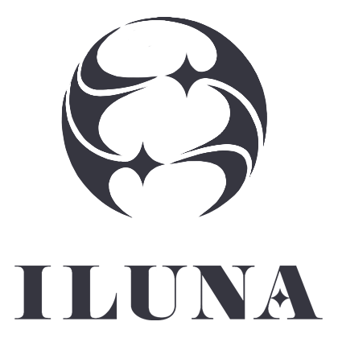

<a name="readme-top">

<br/>

<br />
<div align="center">
  <a href="https://github.com/zyx-0314/">
  <!-- TODO: If you want to add logo or banner you can add it here -->
    
  </a>
<!-- TODO: Change Title to the name of the title of your Project -->
  <h3 align="center">Hero and Card Designs</h3>
</div>
<!-- TODO: Make a short description -->
<div align="center">
Vtuber group ILUNA themed!
</div>

<br />

<!-- TODO: Change the zyx-0314 into your github username  -->
<!-- TODO: Change the WD-Template-Project into the same name of your folder -->


---

<br />
<br />

<!-- TODO: If you want to add more layers for your readme -->
<details>
  <summary>Table of Contents</summary>
  <ol>
    <li>
      <a href="#overview">Overview</a>
      <ol>
        <li>
          <a href="#key-components">Key Components</a>
        </li>
        <li>
          <a href="#technology">Technology</a>
        </li>
      </ol>
    </li>
    <li>
      <a href="#rule,-practices-and-principles">Rules, Practices and Principles</a>
    </li>
    <li>
      <a href="#resources">Resources</a>
    </li>
  </ol>
</details>

---

## Overview

<!-- TODO: To be changed -->
<!-- The following are just sample -->
ILUNA (vtuber group) themed website to demonstrate
Hero page design and static/animated card designs.

Guiding Question:
- What is the project
The project demonstrates Hero page designs and static/animated card designs.
- Whats the purpose
To demonstrate
- What are key components
Hero page design and static/animated card designs.
- What technology used and how it is used
HTML, CSS, JS

### Key Components
<!-- TODO: List of Key Components -->
<!-- The following are just sample -->
- 5 unique Hero page designs
- Card designs
- Card gallery

### Technology
<!-- TODO: List of Technology Used -->


## Rules, Practices and Principles
1. Always use `WD-` in the front of the Title of the Project for the Subject followed by your custom naming.
2. Do not rename any .html files; always use `index.html` as the filename.
3. Place Files in their respective folders.
4. All file naming are in camel case.
   - Camel case is naming format where there is no white space in separation of each words, the first word is in all lower case while the succeding words first letter are in upper followed by lower cased letters.
   - ex.: buttonAnimatedStyle.css
5. Use only `External CSS`.
6. Renaming of Pages folder names are a must, and relates to what it is doing or data it holding.
7. File Structure to follow below.

```
WD-ProjectName
└─ assets
|   └─ css
|   |   └─ style.css
|   └─ img
|   |   └─ fileWith.jpeg/.jpg/.webp/.png
|   └─ js
|       └─ script.js
└─ pages
|  └─ pageName
|     └─ assets
|     |  └─ css
|     |  |  └─ style.css
|     |  └─ img
|     |  |  └─ fileWith.jpeg/.jpg/.webp/.png
|     |  └─ js
|     |     └─ script.js
|     └─ index.html
└─ index.html
└─ readme.md
```

## Resources

<!-- TODO: Add References -->
| Title | Purpose | Link |
|-|-|-|
| Google Fonts | Fonts | https://fonts.google.com/ |
|Introduction to timeline-animation | Timeline animation | https://tympanus.net/codrops/2024/01/17/a-practical-introduction-to-scroll-driven-animations-with-css-scroll-and-view/ |
| Timeline Animation | Timeline-animation implementation | https://developer.mozilla.org/en-US/docs/Web/CSS/animation-timeline https://www.youtube.com/watch?v=kAtuZDPe9DE |
| Guide for UI | UI Design | https://ishadeed.com/article/handling-text-over-image-css/ |
|W3Schools| HTML, CSS | https://www.w3schools.com/ |
|Figma | Design Plan | https://www.figma.com/design/qxZx7163HeuxHngdIsoCwl/Design-ILUNA?node-id=0-1&t=snbQGIGMgSG26xwg-1 |
| Renvader | Ren page | https://x.com/Haku60733327/status/1661875517274898432 |
|Nijisanji | Website theme | https://www.nijisanji.jp/en/talents?filter=nijisanjien |
| Virtual Youtuber Wiki | Media Assets | https://virtualyoutuber.fandom.com/wiki/Maria_Marionette |
Bootstrap Carousel | Carousel | https://getbootstrap.com/docs/5.3/examples/carousel/ |